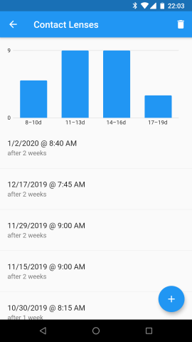

# Zenobase Durations

## Features

- Simple app to keep track of how long it's been since "x" occurred.
- Runs on Android 4.1 and iOS 8 (or later).
- Supports both light and dark themes.
- Translated to English, French and German.

## Screenshots

