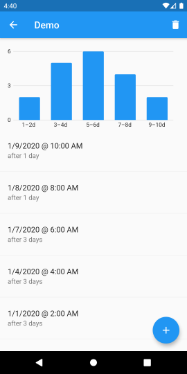

# Zenobase Durations

## Features

- Simple app for logging events as they occur, and seeing how much time has passed since the last occurrence.
- Data is stored locally, and can be exported to a spreadsheet.
- Translated to English, French and German.
- Supports both light and dark themes.
- Runs on Android 4.1 and iOS 8 (or later).
- Available on [Google Play](https://play.google.com/store/apps/details?id=com.zenobase.durations) and in the [App Store](https://testflight.apple.com/join/2yFSm6KQ) (in beta).

## Screenshots

